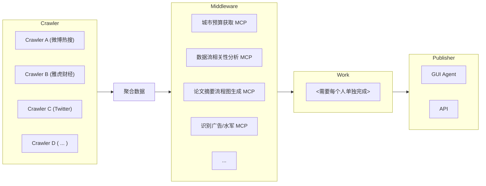

# Practise-Agent-Kits

科研实践的 Agent kits 集合。

本仓库主要包含下面的工具集合。

- crawler: 数据源 & 爬取数据/聚合数据代码
- middleware: 生成结果的中间件（MCP 协议统一开放）
- publisher: 发布组件

```mermaid
flowchart LR
    subgraph Crawlers["Crawler"]
        direction LR
        A1["Crawler A (微博热搜)"]
        A2["Crawler B (雅虎财经)"]
        A3["Crawler C (Twitter)"]
        A4["Crawler D ( ... )"]
    end

    %% --- 中间层 ---
    subgraph Middleware["Middleware"]
        direction LR
        C1["城市预算获取 MCP"]
        C2["数据流相关性分析 MCP"]
        C3["论文摘要流程图生成 MCP"]
        C4["识别广告/水军 MCP"]
        C5["..."]
    end

    %% --- 发布层 ---
    subgraph Publisher["Publisher"]
        direction LR
        P1["GUI Agent"]
        P2["API"]
    end

    subgraph Work["Work"]
        direction LR
        W1[" <需要每个人单独完成> "]
    end


    Crawlers --> DB1["聚合数据"] --> Middleware

    Middleware --> Work --> Publisher
```